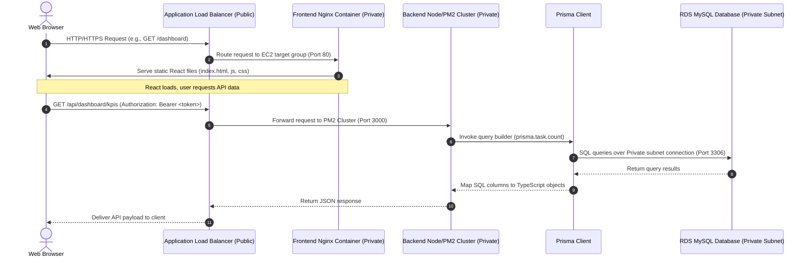
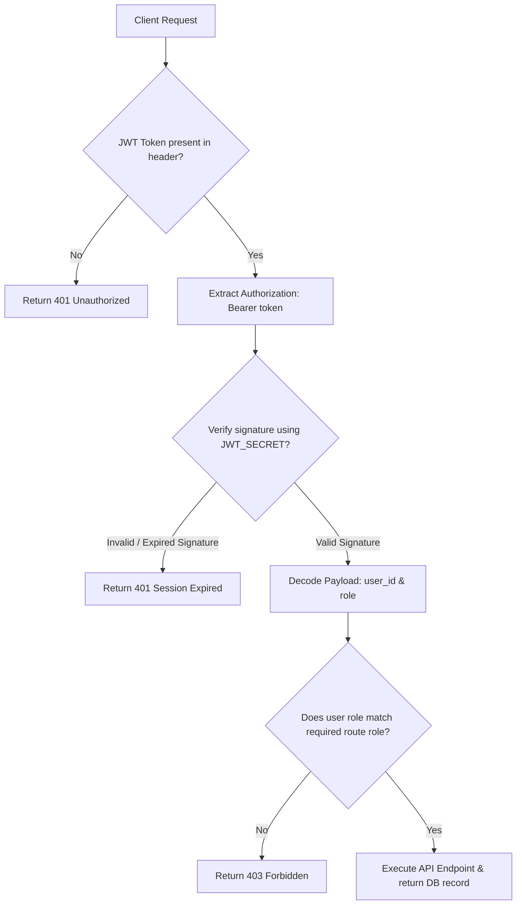
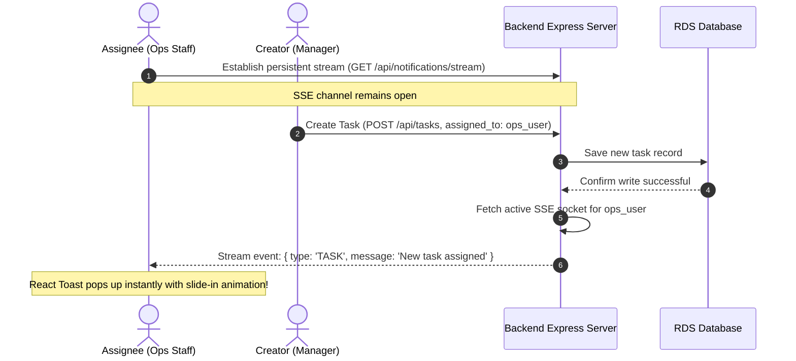

# Exam Prep: Architectural Workflows

This document visualizes and describes the step-by-step logic workflows that occur inside the **RetailEdge Omnichannel Commerce Cloud (ReOm.Co)** platform.

---

## 1. User Request Routing Workflow

This flow shows how a web browser accesses the dashboard and retrieves data from the private database.

---

## 2. Authentication & RBAC Guard Workflow

This workflow represents the request lifecycle checking for token signature and role-based permissions.

---

## 3. Real-Time Push Notification Workflow (SSE)

This diagram shows how Server-Sent Events allow real-time UI updates (like new tasks) without continuous HTTP polling.

---

## 4. Automated S3 Database Backup Workflow

This flow shows how the automated shell script securely copies database dumps into off-site Amazon S3 storage.

```mermaid
flowchart LR
    A[Cron Daemon] -- Trigger daily at 2:00 AM --> B[Execute backup.sh]
    B --> C[Read credentials from apps/backend/.env]
    C --> D[Run mysqldump locked-free against RDS]
    D --> E[Save local backup.sql]
    E --> F[Compress to backup.sql.tar.gz via gzip]
    F --> G[Upload to S3 Bucket via AWS CLI]
    G --> H[Prune local backup files older than 7 days]
```

