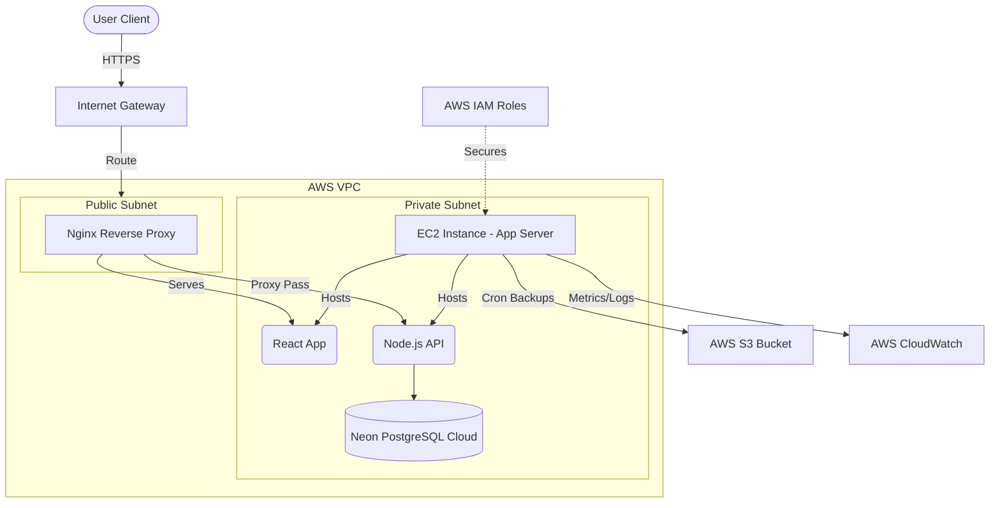

# AWS Architecture Design

## Overview
ReOm.Co will be deployed on Amazon Web Services (AWS) using a structured Virtual Private Cloud (VPC) environment for security and isolation.

## Core AWS Services
1. **VPC (Virtual Private Cloud)**: Custom network isolation.
   - Public Subnets: Nginx Reverse Proxy / Load Balancer.
   - Private Subnets: EC2 instances running application containers.
2. **EC2 (Elastic Compute Cloud)**: Hosts the Dockerized application stack.
3. **S3 (Simple Storage Service)**: Stores database backups generated by automated scripts.
4. **IAM (Identity and Access Management)**: Manages strict permissions for roles like Admin, Monitoring, and Backup.
5. **CloudWatch**: Centralized logging, metrics collection, and alerting triggers.

## Architecture Diagram

