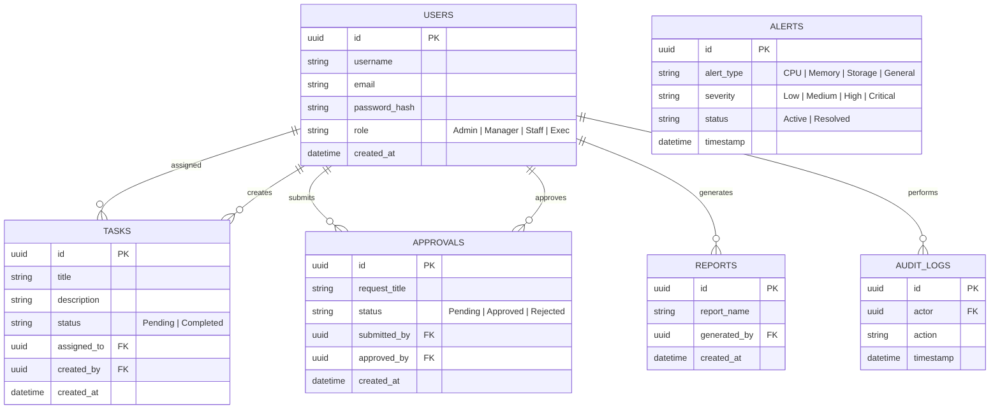

# Database Design & ER Diagram

## Overview
The database uses MySQL to manage application state across users, tasks, approvals, reports, auditing, and system alerts.

## Schema Definitions

- **Users**: Core identities with role-based attributes.
- **Tasks**: Work items assigned to users.
- **Approvals**: Workflow requests that require sign-off.
- **Reports**: Meta-information about generated analytics reports.
- **Audit Logs**: Immutable records of system activities.
- **Alerts**: System health warnings and notifications.

## ER Diagram

